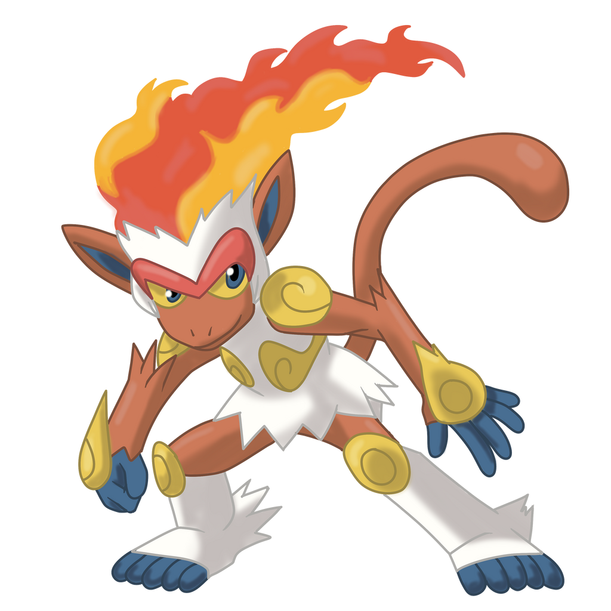
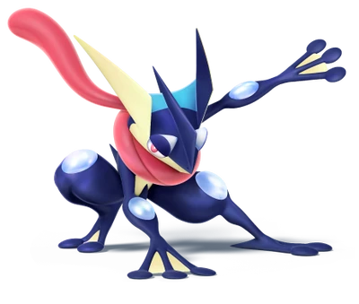

<!-- 1-Encabezados -->
***

# cabecera 1
## cabecera 2
### cabecera 3

<!-- 2-Formato de texto -->
***
Este texto esta en *cursiva*

Este texto esta en **negrita**

Este texto esta ~~tachado~~

Este es un texto <mark>remarcado</mark>

<!-- 3-Listas -->
***

* Desordena item 1
	* Desordena item 2
* Desordena item 2

1. Ordenada 1

	1.1 Macarrones
	
2. Ordenada 2

- [ ] Sacra a pasear al perro
- [x] Comprar macarrones

\* Esto es un asterisco

<!--4-Enlaces-->
***
[Universidad de valencia](https://www.uv.es)

[Universidad de Castellon](https://www.uji.es "La UJI")

<!--5-Citas-->
***

> Esto es una cita

>> Y esto es una subcita

>>> Y ahora vamos a aprender JAVA:

 

---
system.out.println("Hola mundo")
---

 

<!--6-Tablas-->
***
|Nombre       |Tipo             |Poder       |
|-----------  |---------------  |----------  |
|Escavalier   |bicho/acero      |100         |
|Infernape    |fuego/lucha      |180         |
|Greninja     |agua/siniestro   |140         |

<!--7-Imagenes-->
***

<!--8-Emojis para Github-->
***

:smiley:

:sunny:

<!--9-Insertar video de yotube-->
***

